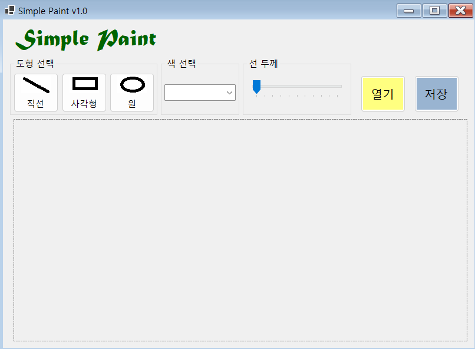
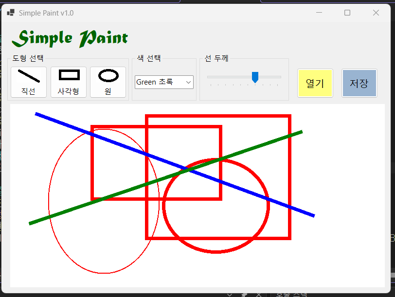
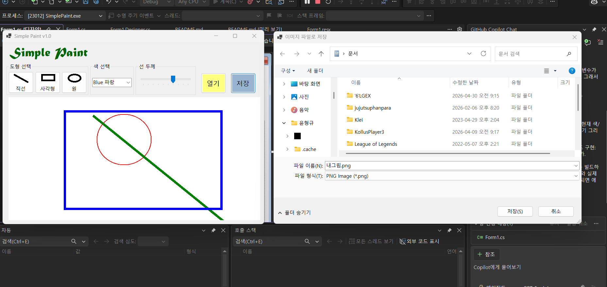
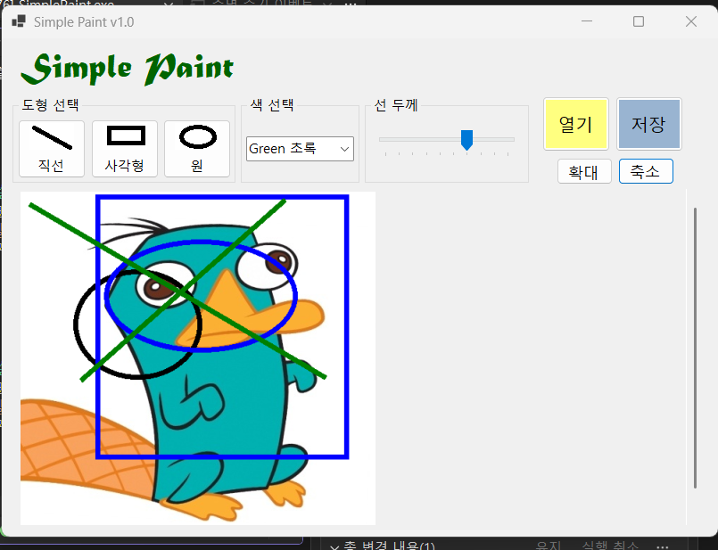
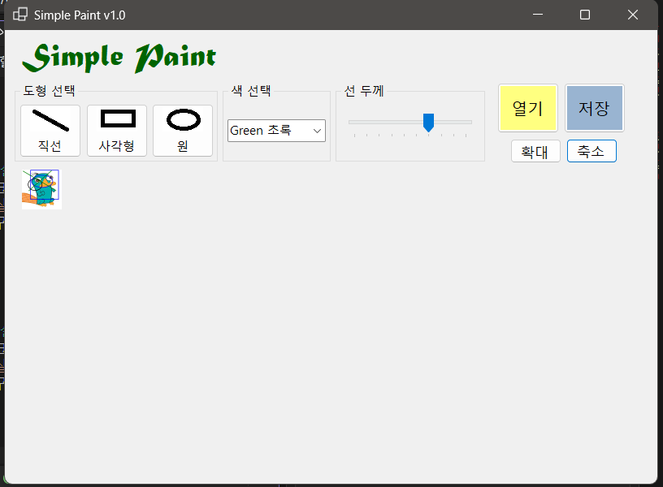

# (C# 코딩) 그림판 (Simple Paint)
## 개요
- C# 프로그래밍학습
- 1줄소개: 사용자 마우스 입력을 통해 간단한 도형과 그림을 그리는 프로그램
- 사용한플랫폼: 
  -C#, .NET Windows Forms, Visual Studio, GitHub
- 사용한컨트롤: 
  - Label, Combobox, ComboBox.SelectedIndex, TrackBar, TrackBar.Value, PictureBox, PictureBox.Image, Button, Graphics, Pen, Bitmap 
- 사용한 기술과 구현한 기능:
  - VisualStudio를 이용하여 기본적인 UI 디자인
  - pictureBox 컨트롤과 비트맵을 이용하여 그림을 그릴 수 있는 캔버스 구현
  - PictureBox: SizeMode=StretchImage 속성을 활용하여 zoomRatio 변경에 따른 유연한 확대/축소 화면 출력
  - Panel: AutoScroll=True 설정을 통해 이미지 크기 증가 시 스크롤바 자동 생성 구현
  - 마우스 입력을 통해 도형 그리기 기능 구현
  - 마우스 입력 시작부분과 끝부분을 이용하여 선, 사각형, 원 그리기 기능 구현
  - 색상 선택 및 펜 크기 조절 기능 구현
  - 도형 그리기 기능 구현 (선, 사각형, 원)
  - SaveFileDialog: Filter 속성을 활용하여 .png, .jpg, .bmp 확장자 선택 기능 구현.

## 실행 화면 (과제1)
- 코드의 실행 스크린샷과 구현 내용 설명

- 구현한 내용 (위 그림 참조)
  - UI 구성 : Label(앱 이름 표시), Combobox(색상 선택), TrackBar(펜 크기 조절), PictureBox(그림 표시), Button(이미지 저장, 이미지 불러오기, 확대, 축소), panel(PictureBox 스크롤바 사용)

## 실행 화면 (과제2)
- 코드의 실행 스크린샷과 구현 내용 설명

- 구현한 내용 (위 그림 참조)
  - 마우스 입력을 통해 선, 사각형, 원 그리기 기능 구현
  - 마우스 클릭을 놓기 전 점선으로 도형의 윤곽이 표시되어 그려질 도형의 위치와 크기를 미리 볼 수 있음
  - 선택된 색상과 펜 크기에 따라 도형이 그려짐
  - 마우스 드래그로 도형의 크기 조절 가능
  - 콤보박스를 이용하여 4가지 색상 중 하나 선택
  - 트랙바로 펜 크기 1~10 조절 가능

## 실행 화면 (과제3)
- 코드의 실행 스크린샷과 구현 내용 설명

- 구현한 내용 (위 그림 참조)
  - 그려진 그림을 이미지 파일로 저장 가능
  - 기본 저장 이름은 "내 그림.png"로 설정
  - SaveFileDialog를 이용하여 파일 저장 위치와 이름 지정
  - .png, .jpg, .bmp 세 가지 형식으로 저장 가능

## 실행 화면 (과제4)
- 코드의 실행 스크린샷과 구현 내용 설명

  - 사진을 불러와 위에 그림을 그린 화면

  - 축소를 한 화면
- 구현한 내용 (위 그림 참조)
  - 이미지를 불러와서 pictureBox에 표시하여 캔버스로 사용가능
  - 불러온 이미지 위에 그림을 그리는 기능 구현
  - 확대 및 축소를 해도 사진 위 그림은 사진위에 그대로 유지되도록 구현
  - 확대/축소 비율(zoomRatio)이 적용된 상태에서 마우스 클릭 시, 화면 좌표를 실제 비트맵 좌표로 변환하기 위해 (e.X / zoomRatio) 연산을 적용하여 정확한 위치에 그림이 그려지도록 보정함.
  - 이미지 크기가 pictureBox보다 클 경우 자동으로 스크롤 바로 조절하여 전체 이미지가 보이도록 구현
  - 이미지를 저장할 때 원본비율을 유지하도록 bitmap 크기 조절 기능 구현
  - Image.FromFile을 통해 불러온 원본 해상도를 유지하면서, 편집 시에는 새로운 Bitmap과 Graphics 객체를 생성하여 원본 이미지가 훼손되지 않도록 관리함
  
